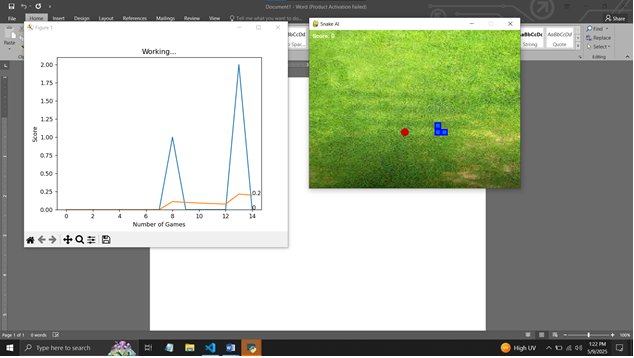
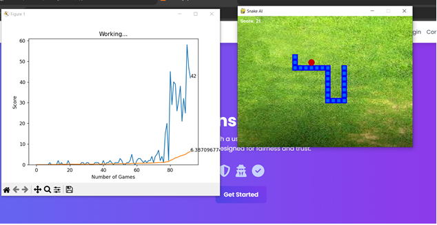

# Reinforcement Learning for Snake Game AI
**Video Link : https://www.youtube.com/watch?v=JdQCcS8N6dY**

**Project Report**  
**Submitted By:**  
M. Sami Faisal (22K-6009)  
Syed Muhammad Sufyan (22K-6012)  
Muhammad Yasir (22K-5090)  

**Course:** Artificial Intelligence  
**Instructor:** Ms. Almas Ayesha Ansari  
**Submission Date:** May 9, 2025  
**Department:** Department of Computer Science, National University of Computing and Emerging Sciences  

## How to Run
**Install Libraries**
-Pytorch
-Matplotlib
-Pygame
-platform
-numpy
-random
-enum

After installing the libraries:
**run python agent.py**

---

## Table of Contents
- [Abstract](#abstract)
- [1. Introduction](#1-introduction)
- [2. Methodology](#2-methodology)
  - [2.1 Reinforcement Learning Framework](#21-reinforcement-learning-framework)
  - [2.2 Neural Network](#22-neural-network)
  - [2.3 Training Process](#23-training-process)
- [3. Implementation](#3-implementation)
- [4. Results, Analysis, and Evaluation](#4-results-analysis-and-evaluation)
- [5. Conclusion](#5-conclusion)
- [6. References](#6-references)

---

## Abstract
This project develops an AI agent to play the classic Snake game using Deep Q-Learning, a reinforcement learning technique. Implemented in Python with PyTorch for the neural network and Pygame for the game interface, the agent learns to navigate, avoid collisions, and maximize its score by consuming food. Performance is evaluated through score trends and high scores, visualized using Matplotlib. This README details the methodology, implementation, results, and limitations of the approach.

---

## 1. Introduction
The Snake game is a classic arcade game where a snake eats food to grow while avoiding collisions with itself or the game boundaries. This project trains an AI agent to play Snake autonomously using Deep Q-Learning. The agent uses a neural network to approximate Q-values, balancing exploration and exploitation to optimize its score. This report outlines the reinforcement learning framework, implementation, and performance evaluation.

---

## 2. Methodology

### 2.1 Reinforcement Learning Framework
The agent employs Q-learning, a model-free reinforcement learning algorithm, with the following components:
- **State**: A 2D vector encoding:
  - Danger indicators (straight, right, left).
  - Current direction (left, right, up, down).
  - Food location relative to the snake's head.
- **Action**: Three actions: move straight, turn right, or turn left, encoded as one-hot vectors ([1,0,0], [0,1,0], [0,0,1]).
- **Reward**:
  - +10 for eating food.
  - -10 for game over (collision or timeout).
  - 0 otherwise.
- **Q-Value**: Approximated by a neural network, representing the expected cumulative reward for an action in a state.
- **Policy**: Epsilon-greedy, starting with ε=0.8 and decaying to favor exploitation over exploration.

### 2.2 Neural Network
A deep neural network (Linear_QNet) built with PyTorch approximates Q-values. It takes the state vector as input and outputs Q-values for each possible action.

### 2.3 Training Process
The training process includes:
- **Short-Term Memory**: Updates Q-values after each step using the tuple (state, action, reward, next state, done).
- **Long-Term Memory**: Stores experiences in a replay buffer (deque, max size 100,000). Mini-batches of 1,000 experiences are sampled for training.
- **Bellman Update**: Computes target Q-value as Qnew = r + γ·max(Q(next state)), where γ=0.9 is the discount factor.
- **Model Saving**: Saves the model when a new high score is achieved.

---

## 3. Implementation
The project is implemented in Python 3.8+ using the following libraries:
- **Pygame**: Renders the game interface.
- **PyTorch**: Builds and trains the neural network.
- **NumPy**: Handles state vector computations.
- **Matplotlib**: Visualizes training progress.

**Codebase Modules**:
1. `snake_game.py`: Manages game logic, including movement, collision detection, and rendering.
2. `model.py`: Defines the Linear_QNet neural network and QTrainer for training.
3. `agent.py`: Implements the Agent class for state extraction, action selection, and memory management.
4. `plotter.py`: Plots scores and mean scores over games.

**Game Specifications**:
- Frame rate: 25 FPS
- Grid size: 640x480 pixels
- Block size: 20 pixels

---

## 4. Results, Analysis, and Evaluation
The agent was trained over multiple games, with performance measured by score (food consumed) and record high score. Key observations:
- **Initial Performance**: Scores of 0–2 in early games due to random actions (high ε).
- **Learning Progress**: After 100 games, scores improved to 5–10, indicating better decision-making.
- **Long-Term Trends**: Mean scores stabilized, though high variance persisted due to the game's stochastic nature.

  
*Screenshot of the snake's score in early games, showing exploration-heavy behavior.*

After 80-100 games, the agent consistently scored 30–50 points, leveraging Q-learning and memory-based estimations. Limitations include sensitivity to hyperparameters (e.g., epsilon decay rate, learning rate) and occasional training instability due to the exploration-exploitation trade-off.

  
*Plot of individual scores (volatile) and mean scores (smoother, upward-trending) over games.*

---

## 5. Conclusion
This project successfully trained a Deep Q-Learning agent to play the Snake game, demonstrating improved navigation and scoring over time. The neural network and replay buffer ensured effective learning. Future enhancements could include hyperparameter tuning, adopting double Q-learning to reduce Q-value overestimation, or exploring algorithms like Deep Deterministic Policy Gradients (DDPG). The project showcases reinforcement learning's potential for complex, dynamic tasks.

---

## 6. References
- Sutton, R. S., & Barto, A. G. (2018). *Reinforcement Learning: An Introduction*. MIT Press.
- Mnih, V., et al. (2015). Human-level control through deep reinforcement learning. *Nature*, 518(7540), 529–533.
- [PyTorch Documentation](https://pytorch.org/docs/stable/index.html)
- [Pygame Documentation](https://www.pygame.org/docs/)

